# System Diagrams

Here are the Mermaid diagrams for the TableTap system, based on the codebase analysis.

## 1. User Interface Diagram (UI Map)
This diagram shows the hierarchy of screens and routing structure for both the Client (Diner) and Admin/Staff sides.

## 2. User Flow Diagram (Ordering Process)
This diagram illustrates the flow of data and user actions from the moment a diner initiates an order to the backend processing.

```mermaid
sequenceDiagram
    participant Diner as 👤 Diner (Frontend)
    participant UI as 📱 UI Components
    participant API as 🌐 Backend API (NestJS)
    participant DB as 🗄️ Database
    participant Kitchen as 👨‍🍳 Kitchen/Staff

    Note over Diner, UI: Client Side Interaction

    Diner->>UI: Scans QR / Opens Menu
    UI->>API: GET /product/product/:restaurantId
    API->>DB: Query Products
    DB-->>API: Return Product List
    API-->>UI: Display Menu & Categories

    Diner->>UI: Selects Item -> Add to Cart
    UI->>UI: Update Local Cart Context

    Diner->>UI: Clicks "Checkout" / "Place Order"
    UI->>API: POST /order/create (or similar)
    
    Note over API, DB: Backend Processing
    
    activate API
    API->>API: Validate Order Data
    API->>DB: Save Order & OrderItems
    API->>DB: Update Inventory (optional)
    DB-->>API: Order Saved
    deactivate API

    API-->>UI: Return Success (Order ID)
    UI-->>Diner: Show "Order Success" Screen

    par Notify Staff
        API->>Kitchen: Real-time Alert (Socket/Polling)
        Kitchen->>API: GET /order/pending
        API-->>Kitchen: Show New Order
    end
```

